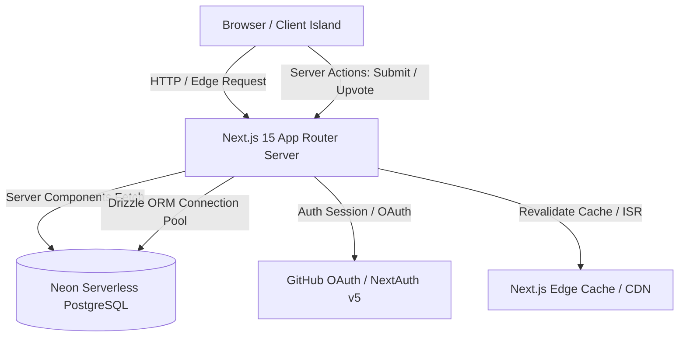
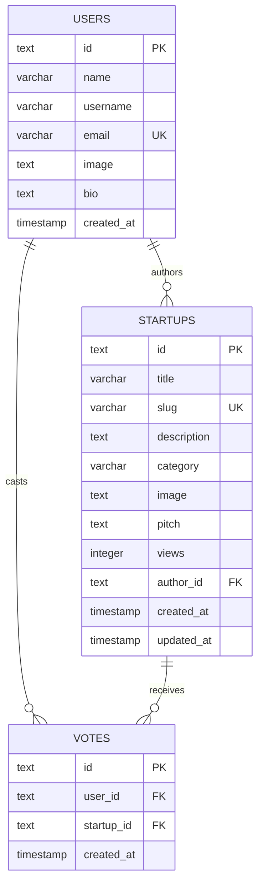

# System Architecture & Technical Specifications
## Project: Pitchery (YC Directory) — Next.js 15 & Neon PostgreSQL

---

## 1. System Architecture Overview

Pitchery utilizes a modern, serverless architecture centered around **Next.js 15 App Router** and **Neon Serverless PostgreSQL**. The application leverages React Server Components (RSC) for data fetching at the edge, Client Components for interactive islands (search debounce, rich markdown editor, live view counts), and Server Actions for type-safe mutations.



---

## 2. Technology Stack Details

| Layer | Technology | Rationale |
| :--- | :--- | :--- |
| **Framework** | Next.js 15 (App Router, React 19) | Server Components for instant page loads, Server Actions for zero-boilerplate API handling |
| **Language** | TypeScript (Strict Mode) | End-to-end type safety across DB schemas, actions, and UI components |
| **Database** | Neon Serverless PostgreSQL | Auto-scaling PostgreSQL with HTTP serverless driver and connection pooling |
| **ORM / Query Builder** | Drizzle ORM | Lightweight, type-safe SQL-first query builder with instant schema migrations |
| **Authentication** | NextAuth.js (Auth.js v5) | Secure GitHub OAuth integration, session cookie management, and user syncing |
| **Styling & Design** | Tailwind CSS v4 + Custom Neo-brutalism tokens | Modular CSS, custom brutalist borders, box-shadows, and pinstripe SVG backgrounds |
| **Markdown Processing** | `@uiw/react-md-editor` + `react-markdown` + `remark-gfm` + `rehype-sanitize` | Rich formatting studio with safe, sanitized client & server rendering |
| **Validation** | Zod | Runtime schema validation for forms, environment variables, and Server Actions |
| **Icons & Media** | Lucide React | Crisp, customizable vector icons matching the UI aesthetics |

---

## 3. Database Schema Design (Neon PostgreSQL / Drizzle ORM)

### 3.1 Tables & Relations Diagram



### 3.2 Drizzle Schema Definition (`src/db/schema.ts`)

```typescript
import { pgTable, text, varchar, timestamp, integer, uniqueIndex, index } from "drizzle-orm/pg-core";
import { sql } from "drizzle-orm";

// 1. Users Table
export const users = pgTable("users", {
  id: text("id").primaryKey().$defaultFn(() => crypto.randomUUID()),
  name: varchar("name", { length: 255 }).notNull(),
  username: varchar("username", { length: 255 }).notNull().unique(),
  email: varchar("email", { length: 255 }).notNull().unique(),
  image: text("image"),
  bio: text("bio"),
  createdAt: timestamp("created_at").defaultNow().notNull(),
});

// 2. Startups Table
export const startups = pgTable(
  "startups",
  {
    id: text("id").primaryKey().$defaultFn(() => crypto.randomUUID()),
    title: varchar("title", { length: 255 }).notNull(),
    slug: varchar("slug", { length: 255 }).notNull().unique(),
    description: text("description").notNull(),
    category: varchar("category", { length: 100 }).notNull(),
    image: text("image").notNull(),
    pitch: text("pitch").notNull(),
    views: integer("views").default(0).notNull(),
    authorId: text("author_id")
      .notNull()
      .references(() => users.id, { onDelete: "cascade" }),
    createdAt: timestamp("created_at").defaultNow().notNull(),
    updatedAt: timestamp("updated_at").defaultNow().notNull(),
  },
  (table) => ({
    categoryIdx: index("category_idx").on(table.category),
    authorIdx: index("author_idx").on(table.authorId),
    createdIdx: index("created_idx").on(table.createdAt),
  })
);

// 3. Votes Table (Upvoting System)
export const votes = pgTable(
  "votes",
  {
    id: text("id").primaryKey().$defaultFn(() => crypto.randomUUID()),
    userId: text("user_id")
      .notNull()
      .references(() => users.id, { onDelete: "cascade" }),
    startupId: text("startup_id")
      .notNull()
      .references(() => startups.id, { onDelete: "cascade" }),
    createdAt: timestamp("created_at").defaultNow().notNull(),
  },
  (table) => ({
    userStartupUnique: uniqueIndex("user_startup_unique").on(table.userId, table.startupId),
  })
);
```

---

## 4. Application Directory Structure

```
pitchery/
├── src/
│   ├── app/
│   │   ├── (root)/
│   │   │   ├── layout.tsx                # Global Shell (Header, Providers)
│   │   │   ├── page.tsx                  # Home & Startup Discovery Feed
│   │   │   ├── startup/
│   │   │   │   ├── [id]/page.tsx         # Startup Pitch Details Page
│   │   │   │   └── create/page.tsx       # Pitch Submission Form
│   │   │   └── user/
│   │   │       └── [id]/page.tsx         # Founder Profile Showcase
│   │   ├── api/
│   │   │   └── auth/[...nextauth]/route.ts # NextAuth Route Handler
│   │   ├── globals.css                   # Global styles & Neo-brutalist utilities
│   │   └── layout.tsx                    # Root HTML layout with Fonts
│   ├── components/
│   │   ├── navbar.tsx                    # Global Neo-brutalist header
│   │   ├── hero-banner.tsx               # Striped Hero with fold tag
│   │   ├── search-bar.tsx                # Debounced search input
│   │   ├── startup-card.tsx              # Brutalist startup pitch card
│   │   ├── startup-form.tsx              # Form with Markdown editor
│   │   ├── markdown-editor.tsx           # Rich Markdown editing toolbar
│   │   ├── markdown-renderer.tsx         # Safe sanitized markdown view
│   │   ├── profile-card.tsx              # Founder avatar & bio sidebar
│   │   ├── view-counter.tsx              # Real-time view incrementer
│   │   └── ui/
│   │       ├── button.tsx
│   │       ├── input.tsx
│   │       ├── badge.tsx
│   │       └── toast.tsx
│   ├── db/
│   │   ├── index.ts                      # Neon DB connection pooling
│   │   ├── schema.ts                     # Drizzle schema definitions
│   │   └── seed.ts                       # Realistic sample data seed
│   ├── lib/
│   │   ├── actions.ts                    # Server Actions (Mutations)
│   │   ├── auth.ts                       # NextAuth v5 configuration
│   │   ├── validation.ts                 # Zod validation schemas
│   │   └── utils.ts                      # Helper routines (slugify, dates, formatting)
│   └── types/
│       └── index.ts                      # Shared TypeScript definitions
├── drizzle.config.ts                     # Drizzle migration config
├── next.config.ts                        # Next.js configurations & remote image patterns
├── tailwind.config.ts                    # Neo-brutalist theme configuration
├── package.json
└── tsconfig.json
```

---

## 5. Server Actions & Data Mutation Flow

### 5.1 Pitch Submission Flow (`createStartupAction`)
1. Client submits form data with Title, Description, Category, Image Link, and Markdown Pitch.
2. Zod validates payload against `StartupFormSchema`.
3. Session verified through NextAuth (retrieves `authorId`).
4. Generates unique slug (`slugify(title)` with collision fallback).
5. Executes SQL `INSERT` via Drizzle into Neon DB.
6. Calls `revalidatePath('/')` and `revalidatePath('/user/[id]')` to invalidate cache.
7. Redirects user to `/startup/${newStartup.id}`.

### 5.2 Atomic View Increment Flow (`incrementViewCountAction`)
1. When a user navigates to `/startup/[id]`, a non-blocking background server action is dispatched.
2. Executes atomic SQL: `UPDATE startups SET views = views + 1 WHERE id = $id RETURNING views;`.
3. Neon handles concurrent increments gracefully with zero row locking contention.

---

## 6. Neon Serverless Configuration & Optimization

```typescript
// src/db/index.ts
import { neon, neonConfig } from '@neondatabase/serverless';
import { drizzle } from 'drizzle-orm/neon-http';
import * as schema from './schema';

neonConfig.fetchConnectionCache = true;

const sql = neon(process.env.DATABASE_URL!);
export const db = drizzle(sql, { schema });
```

- **Serverless Connection Pooling**: Uses Neon's HTTP-based driver to eliminate TCP connection overhead in Edge and Serverless functions.
- **Branching Workflows**: Leverages Neon branch isolation for feature preview environments.
