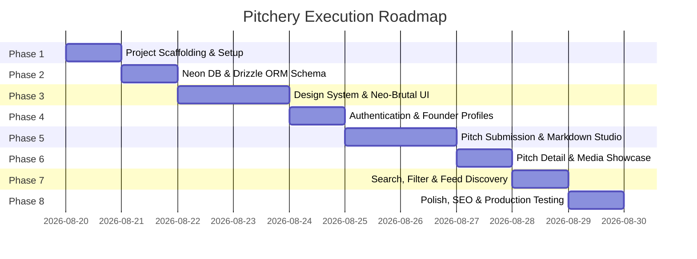

# Project Execution Phases & Roadmap
## Project: Pitchery (YC Directory)

---

## Overview Roadmap

---

## Detailed Execution Phases

### Phase 1: Environment & Project Scaffolding
- [x] Initialize Next.js 15 with TypeScript, App Router, and Tailwind CSS.
- [ ] Install core dependencies:
  - Neon DB & Drizzle ORM: `@neondatabase/serverless`, `drizzle-orm`, `drizzle-kit`, `dotenv`.
  - Authentication: `next-auth@beta` (Auth.js v5).
  - UI & Markdown: `lucide-react`, `@uiw/react-md-editor`, `react-markdown`, `remark-gfm`, `rehype-sanitize`, `clsx`, `tailwind-merge`.
  - Validation: `zod`.
- [ ] Configure `next.config.ts` (remote image domains for GitHub, Unsplash, Google).
- [ ] Setup base `.env.example` and environment variables structure (`DATABASE_URL`, `AUTH_SECRET`, `AUTH_GITHUB_ID`, `AUTH_GITHUB_SECRET`).

---

### Phase 2: Database Layer & Neon PostgreSQL Integration
- [ ] Set up Neon Serverless connection client in `src/db/index.ts`.
- [ ] Define relational schemas in `src/db/schema.ts`:
  - `users` table with GitHub OAuth profile mappings.
  - `startups` table with titles, slugs, categories, rich markdown pitch content, media links, and views.
  - `votes` table for community upvoting and popularity metrics.
- [ ] Configure `drizzle.config.ts` for schema migration automation.
- [ ] Implement database seeding script `src/db/seed.ts` populated with realistic startup pitches (e.g. EcoTrack, YC Academy, DevFlow, SaaSMetrics).

---

### Phase 3: Design System & Core Neo-Brutalist Components
- [ ] Configure Tailwind CSS design tokens and theme extensions:
  - Custom colors: `#EE2B69` (Brand Pink), `#FBE843` (Vibrant Yellow), `#141413` (Dark Charcoal), `#F7F7F7` (Canvas).
  - Pinstripe background pattern utility (`bg-pinstripe`).
  - Brutalist hard box-shadows (`shadow-brutal-sm`, `shadow-brutal-md`, `shadow-brutal-lg`).
- [ ] Build reusable UI primitives:
  - `Navbar`: Brand logo with lightning spark icon, `Create` button, `Logout`/`Login` trigger, and user avatar.
  - `HeroBanner`: Striped hot pink container with folded ribbon badge.
  - `PillButton` & `Badge`: Rounded pill controls with thick black borders.
  - `SearchBar`: Pill search input with integrated search action button.
  - `StartupCard`: Neo-brutalist pitch card with date badge, view counter, media preview, and category pill.

---

### Phase 4: Authentication & User Profiles
- [ ] Configure NextAuth.js (Auth.js v5) with GitHub OAuth provider.
- [ ] Implement guest/demo session fallback for instant testing without mandatory API keys.
- [ ] Build Founder Profile page (`/user/[id]`):
  - Left sidebar founder badge card with doodle spark accents, avatar, and bio.
  - Right column grid displaying all pitches authored by the founder.
  - Live query filtering startups by `author_id`.

---

### Phase 5: Pitch Submission & Markdown Studio
- [ ] Create Pitch Submission page (`/startup/create`):
  - Striped header with black `SUBMIT YOUR STARTUP PITCH` banner.
  - Responsive multi-field form (Title, Description, Category, Image/Video Link).
- [ ] Build interactive Markdown Editor island:
  - Live formatting toolbar (Heading, Bold, Italic, Underline, Lists, Links, Image embed).
  - Live markdown preview mode with synchronized scrolling.
- [ ] Implement `createStartupAction` Server Action:
  - Zod validation for input fields.
  - Slug generation and collision resolution.
  - Neon DB record insertion and path revalidation.
  - Toast error/success feedback.

---

### Phase 6: Pitch Detail Showcase & Media Display
- [ ] Build Pitch Details page (`/startup/[id]`):
  - Hero header with folded yellow date tag and startup title/tagline.
  - High-resolution media showcase container (image preview or embedded video).
  - Founder metadata bar with avatar, handle, and category badge.
  - Sanitized rich markdown pitch breakdown rendered with custom typography.
- [ ] Real-time view count tracking:
  - Atomic Neon SQL increment dispatched upon page load.
- [ ] "Similar Startups" recommendation algorithm based on matching category.

---

### Phase 7: Search, Filtering & Discovery Feed
- [ ] Build Home / Explore page (`/`):
  - Dynamic search bar with URL query param syncing (`?query=...`).
  - Full-text search over titles, descriptions, and categories.
  - Category pill filter tabs for instant category filtering.
  - Dynamic grid rendering recommended and trending pitches.
- [ ] Empty search state with playful Neo-brutalist illustrations.

---

### Phase 8: Polish, Performance & Production Readiness
- [ ] Performance audit (Lighthouse optimization, image priority loading).
- [ ] Responsive testing across mobile, tablet, and widescreen viewports.
- [ ] OpenGraph metadata generator for social media card sharing.
- [ ] Error boundaries (`error.tsx`), 404 page (`not-found.tsx`), and loading skeleton screens (`loading.tsx`).
